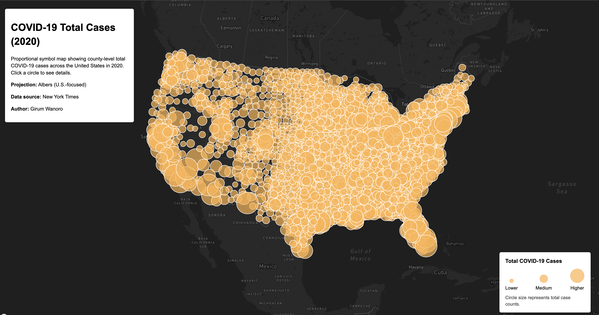

# COVID-19 in the United States (2020)

This project presents two interactive web maps that visualize the spatial distribution of COVID-19 cases across the United States in 2020. Using county-level data from the New York Times, the maps show both case rates and total case counts to highlight different geographic patterns of the pandemic.

---

## Map 1: COVID-19 Case Rates (Choropleth)

This choropleth map displays COVID-19 case rates per 1,000 people by county in 2020. Counties are shaded from light to dark, with darker colors representing higher case rates relative to population size. This map emphasizes relative risk and allows comparison across counties with different population sizes.

**Live Map:**  
https://giruml34.github.io/covid-us-2020-maps/map1.html

**Features:**
- County-level polygons
- Color-scaled choropleth
- Interactive popups showing county name, state, and case rate
- Albers projection optimized for the United States

---

## Map 2: COVID-19 Total Cases (Proportional Symbols)

This proportional symbol map represents total COVID-19 case counts by county in 2020. Each county is shown as a circle, with larger circles indicating higher total case numbers. This map highlights population centers and areas with the highest absolute number of cases.

**Live Map:**  
https://giruml34.github.io/covid-us-2020-maps/map2.html

**Features:**
- County centroid point data
- Circle size scaled by total case count
- Interactive popups showing county name, state, and total cases
- Custom legend explaining symbol size
- Albers projection optimized for the United States

---

## Data Source
- New York Times COVID-19 county-level dataset (2020)

---

## Tools & Technologies
- Mapbox GL JS  
- GeoJSON  
- Mapshaper  
- HTML, CSS, and JavaScript  
- GitHub Pages  

---

## Author
Girum Wanoro

## Live Maps
- Map 1 (Case Rates): map1.html
- Map 2 (Total Cases): map2.html

